# Store

Follow the link to view the site [Store](https://dummyjson.com)

Online store selling goods of various categories with the possibility to create
a shopping cart and place an order. It is a single-page site with two pages:

- Products page
- Basket/Cart of goods

## Products page

The page consists of a header, a category and search filter field, a product
cards field, and a "Loadmore" button.

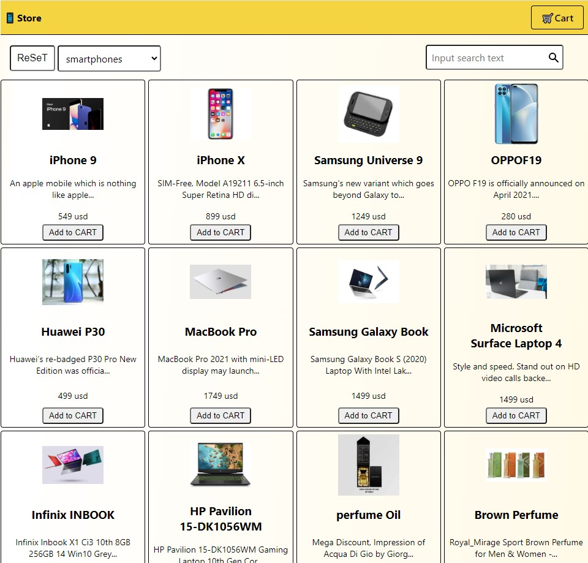

### Header

The header contains the Logo, the Cart button and the dynamic Total field. The
header has Sticky positioning, so it does not hide when scrolling.

- Logo - when clicked, you will be taken to the product page
- Cart link - when pressed, a transition to the product basket page takes place,
  has a hover effect and highlights the active status
- Total field - appears when goods appear in the cart and displays the total of
  the cart's contents in value terms. When the cart is cleared, the total
  disappears.

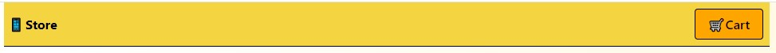 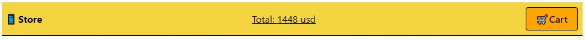

### Filter & Search field

The search and filtering field consists of:

- Filtering by categories from the drop-down menu and the Reset button
- Search filters the list of products based on the entered search query. The
  search is performed dynamically with the input of characters.

#### Filter & Search field

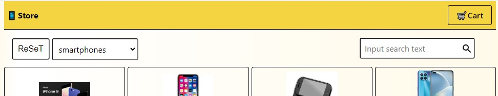

#### Filter options

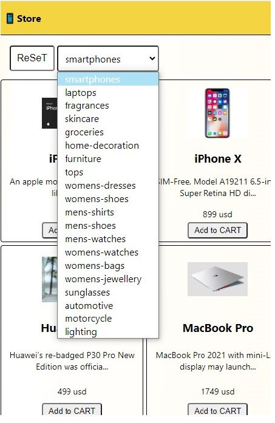

### Products field

The product card display field contains a set of 30 cards. and the Load more
button, which is used to load and expand the list of cards, if the cards for
loading have run out, the button disappears and the message "There are no more
products!" appears.

Product cards consist of a product image, product name, description, price, and
an Add to Cart button for adding the product to the Cart. Product description
reduced to 50 characters.

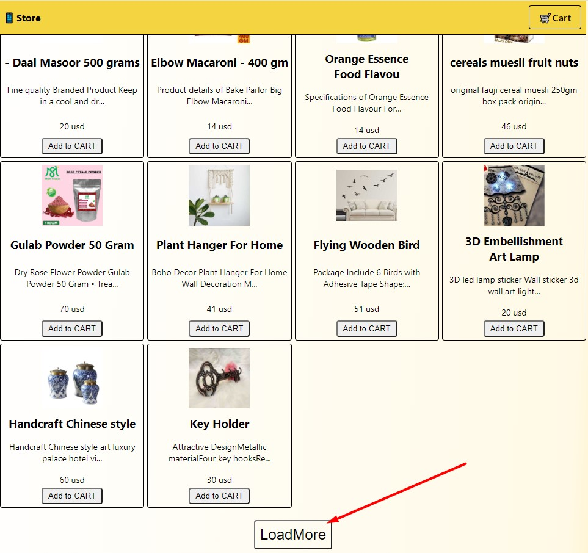
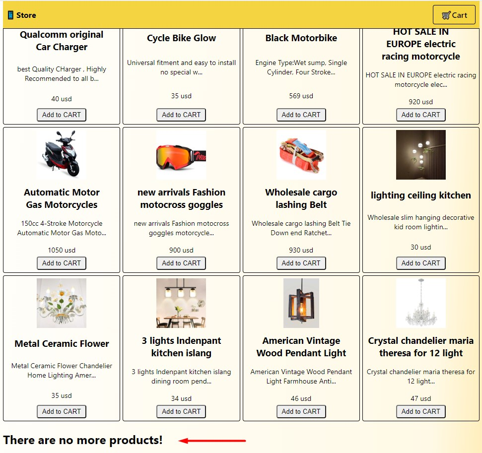

## Cart page

The Сart зфпу consists of a header, a title, a list of cards of added products
or a picture of an empty cart, an order form with Back to Store and Clear Cart
buttons.

### Header

The cart header differs only in the active state of the Cart button.

### Cart field

An empty cart displays the title 'Your CART is EMPTY' and a picture. The Back to
Store button loads the product page

The shopping cart displays a card list of added products, an order form, a Clear
Cart button, and a Back to Store button.

The card of the product in the Cart consists of a picture of the product, name,
description, cost of the selected quantity of the product, buttons to increase
and decrease the quantity, a quantity indicator and a button to remove the
product from the Cart.

Pressing the button to increase and decrease the amount changes the indicator of
the amount of the product and the price of the product. Pressing the delete
button and the button to reduce the quantity of the product in the position of
the quantity indicator 1 - the product is removed from the basket.

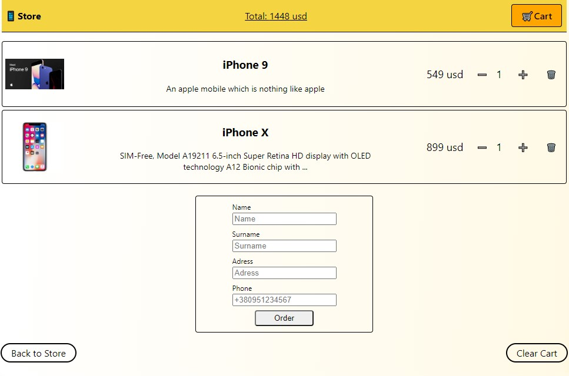 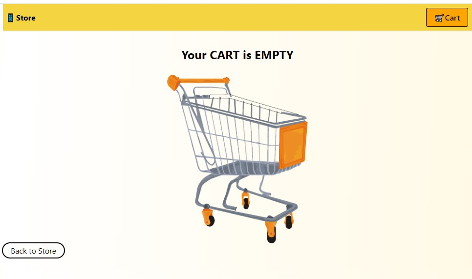

### Form Order

The order form has validation for all fields:

- each field is mandatory
- the number of characters entered in the name surname fields
- the correctness of entering the phone number according to the template
  +380XXXXXXXXX

In case of violation of validation, a message appears under the input field, the
validation of which is violated. If any of the fields are entered incorrectly,
the Order button does not send the order.

If the data is entered correctly, the Order button sends an array with a data
object from the form and a data object with the ordered goods, the form is
reset, the basket is cleared.

The successful dispatch of the order is notified by a notification in the upper
right corner with the text "Thank you for your order, [name surname - data from
the form]!".

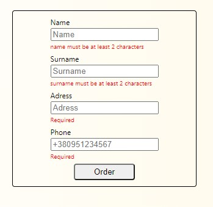
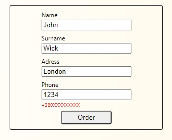
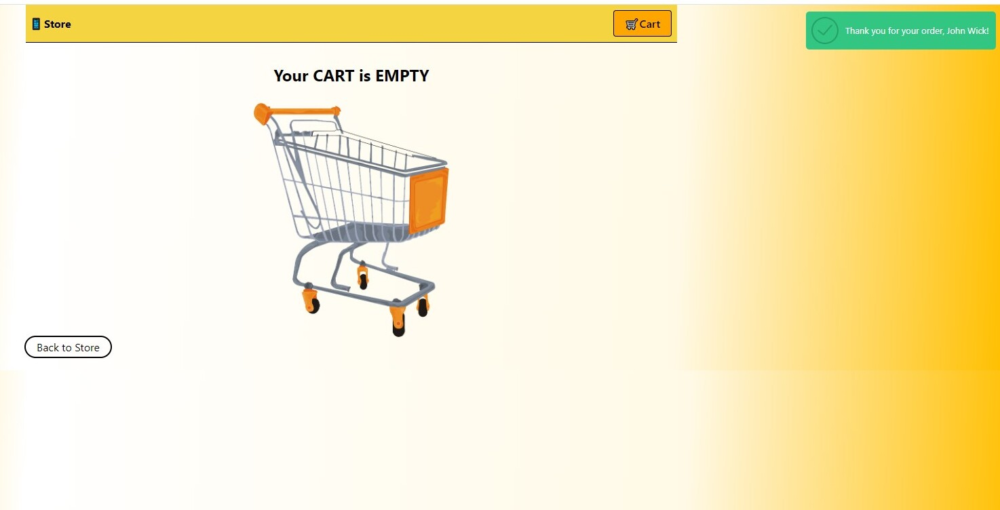

Follow the link to view the site [Store](https://dummyjson.com)

## Technologies

- JavaScript
- React
- react-hook-form
- yup
- react-icons
- react-redux
- redux-toolkit
- react-router-dom
- redux-persist
- asyncthunk
- styled-components
- axios
- gitHub Desctope
- gitHub

# For Developers

This project is developed with
[Create React App](https://github.com/facebook/create-react-app).

## Copy of project

1. Make a copy of this project.
2. Don't forget in properties allow git-hub-actions.
3. Clone the project to your computer
4. Install all dependencies with: `npm i`
5. Change project name and username in package.json in fields "name" and
   "homepage"
6. in index.js write the correct basename="/car-rent" of your project with /
   (slash)
7. Pull your changes to GitHub
8. For deploying, you can use gh-pages.
9. To start your project, use the command: `npm start`

## Backend

Еhe service used for the backend [DummyJSON](https://dummyjson.com).

